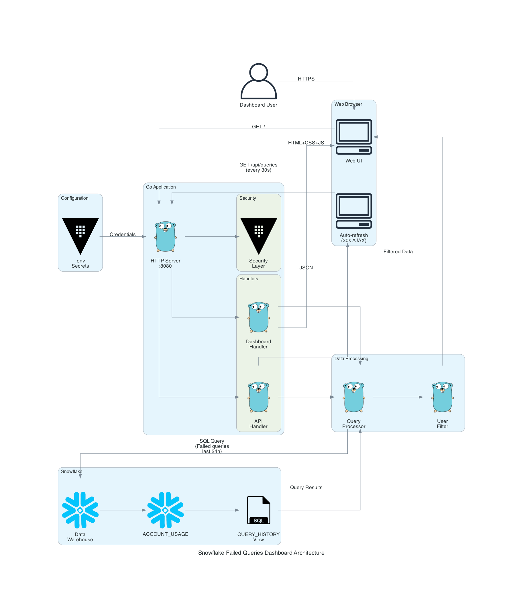

# Snowflake Failed Queries Dashboard

A web application built with Go that displays failed Snowflake queries from the last 24 hours for all users. The dashboard provides a clean, modern interface to monitor and investigate query failures.

## Architecture



The dashboard uses a simple three-tier architecture:
- **Web Browser**: Interactive UI with auto-refresh every 30 seconds
- **Go Application**: HTTP server with security middleware and data processing
- **Snowflake**: Data warehouse providing failed query information from ACCOUNT_USAGE

## Features

- **Auto-Refresh Dashboard**: Automatically updates every 30 seconds with new failed queries
- **User Filtering**: Filter queries by specific users with dropdown selection
- **Real-time Statistics**: Track total failed queries and unique users affected
- **Detailed Information**: See query text, error messages, execution time, user, and timestamps
- **Smart Polling**: Pauses when browser tab is inactive to save resources
- **Manual Refresh**: Instant refresh button for on-demand updates
- **Last Updated Indicator**: Shows how recently data was refreshed
- **REST API**: JSON endpoint for programmatic access
- **Nix Support**: Complete Nix flake for development and deployment
- **Security Hardened**: Includes CSP headers, credential protection, and secure coding practices

## Prerequisites

- Snowflake account with access to `SNOWFLAKE.ACCOUNT_USAGE.QUERY_HISTORY`
- Role with `IMPORTED PRIVILEGES` on SNOWFLAKE database (typically `ACCOUNTADMIN`)
- Go 1.23+ (or use Nix flake)

## Quick Start

### Using Nix (Recommended)

1. **Enter development environment**:
   ```bash
   nix develop
   ```

2. **Create .env file**:
   ```bash
   cp .env.example .env
   # Edit .env with your Snowflake credentials
   ```

3. **Run the application**:
   ```bash
   go run main.go
   ```

4. **Open browser**:
   ```
   http://localhost:8080
   ```

### Without Nix

1. **Install Go dependencies**:
   ```bash
   go mod download
   ```

2. **Create .env file**:
   ```bash
   cp .env.example .env
   # Edit .env with your Snowflake credentials
   ```

3. **Run the application**:
   ```bash
   go run main.go
   ```

## Configuration

The dashboard supports two authentication methods: **password** and **key-pair**.

### Password Authentication (Default)

Configure using environment variables in a `.env` file:

```env
SNOWFLAKE_AUTH_TYPE=password  # Optional, defaults to password
SNOWFLAKE_ACCOUNT=your-account.region
SNOWFLAKE_USER=your-username
SNOWFLAKE_PASSWORD=your-password
SNOWFLAKE_DATABASE=SNOWFLAKE
SNOWFLAKE_SCHEMA=ACCOUNT_USAGE
SNOWFLAKE_WAREHOUSE=your-warehouse
SNOWFLAKE_ROLE=ACCOUNTADMIN
PORT=8080  # Optional, defaults to 8080
```

### Key-Pair Authentication (Recommended for Production)

For enhanced security, use Snowflake key-pair authentication:

```env
SNOWFLAKE_AUTH_TYPE=keypair
SNOWFLAKE_ACCOUNT=your-account.region
SNOWFLAKE_USER=your-username

# Option 1: Path to private key file (recommended)
SNOWFLAKE_PRIVATE_KEY_PATH=/run/secrets/snowflake_key.p8

# Option 2: Base64-encoded key content (alternative)
# SNOWFLAKE_PRIVATE_KEY_CONTENT=<base64-encoded-key>

# Optional: Passphrase for encrypted keys
# SNOWFLAKE_PRIVATE_KEY_PASSPHRASE=your-passphrase

SNOWFLAKE_DATABASE=SNOWFLAKE
SNOWFLAKE_SCHEMA=ACCOUNT_USAGE
SNOWFLAKE_WAREHOUSE=your-warehouse
SNOWFLAKE_ROLE=ACCOUNTADMIN
```

**Generate Key Pair:**

```bash
# 1. Generate private key (unencrypted)
openssl genrsa 2048 | openssl pkcs8 -topk8 -nocrypt -inform PEM -out rsa_key.p8

# 2. Extract public key
openssl rsa -in rsa_key.p8 -pubout -out rsa_key.pub

# 3. Assign to Snowflake user (remove header/footer/newlines)
ALTER USER your_username SET RSA_PUBLIC_KEY='MIIBIjANBgkq...';
```

For encrypted keys with passphrase:

```bash
openssl genrsa 2048 | openssl pkcs8 -topk8 -v2 des3 -inform PEM -out rsa_key.p8
```

See `.env.example` for a complete template and [Snowflake documentation](https://docs.snowflake.com/en/user-guide/key-pair-auth) for details.

## API Endpoints

### Web Dashboard
- `GET /` - HTML dashboard displaying failed queries

### REST API
- `GET /api/queries` - JSON array of failed queries

Example response:
```json
[
  {
    "query_id": "01b2c3d4-5678-90ab-cdef-1234567890ab",
    "query_text": "SELECT * FROM non_existent_table",
    "user_name": "JOHN_DOE",
    "error_message": "SQL compilation error: Object 'NON_EXISTENT_TABLE' does not exist",
    "start_time": "2025-12-11T10:30:00Z",
    "end_time": "2025-12-11T10:30:01Z",
    "execution_time_seconds": 0.45
  }
]
```

## Nix Flake Usage

### Development Shell

Enter a development environment with Go and tools:
```bash
nix develop
```

### Build the Application

Build a standalone binary:
```bash
nix build
./result/bin/snowflake-dashboard
```

### Build Docker Container

Build a Docker/OCI container image:
```bash
nix build .#container
docker load < result
docker run -p 8080:8080 --env-file .env snowflake-dashboard:latest
```

**Note for macOS Users**: Building the container on macOS requires a Linux builder because Docker containers run Linux binaries. You need to configure Nix to use a remote Linux builder (either a VM or remote machine).

**Setting up a Linux Builder on macOS**:

The easiest approach is to use a Linux VM as a builder:

1. **Install and configure a Linux VM** (such as UTM, OrbStack, or Multipass)
2. **Enable SSH access** to the VM
3. **Configure Nix to use the remote builder** by adding to `~/.config/nix/nix.conf`:
   ```
   builders = ssh://username@linux-vm-ip x86_64-linux
   builders-use-ssh = true
   ```
4. **Ensure SSH key authentication** is set up for passwordless access

For detailed setup instructions, see:
- [Nix Remote Builds Documentation](https://nixos.org/manual/nix/stable/advanced-topics/distributed-builds.html)
- [NixOS Wiki: Distributed Builds](https://nixos.wiki/wiki/Distributed_build)
- [Docker Desktop Alternative](https://github.com/abathur/nix-build-on-linux-on-macos) - Automated Linux builder setup for macOS

### NixOS Container

Deploy as a NixOS container:
```bash
# Create password file
echo "your-password" > /run/secrets/snowflake-password

# Build and run container
nixos-container create snowflake-dashboard --flake .#container
nixos-container start snowflake-dashboard
```

## Building with Nix

The flake provides several outputs:

- `devShells.default` - Development environment with Go toolchain
- `packages.default` - The compiled application
- `packages.container` - Docker/OCI container image
- `packages.tailscale-sidecar` - Tailscale networking container (for Tailscale deployment)
- `packages.dashboard-for-tailscale` - Dashboard container optimized for Tailscale
- `nixosModules.default` - NixOS module for system integration
- `nixosConfigurations.container` - Pre-configured container

## Deployment

### Tailscale Deployment (Recommended for Secure Access)

Deploy with Tailscale for group-based access control and automatic HTTPS:

```bash
# 1. Generate Tailscale auth key at https://login.tailscale.com/admin/settings/keys
# 2. Configure environment
cp .env.tailscale.example .env
# Edit .env with your Tailscale auth key and Snowflake credentials

# 3. Build container (if not already built)
nix build .#container
docker load < result

# 4. Start services
docker-compose -f docker-compose.tailscale.yml up -d

# 5. Access via HTTPS
https://snowflake-dashboard.<your-tailnet>.ts.net
```

**Features:**
- **Group-Based Access Control**: Restrict access to specific Tailscale user groups via ACLs
- **Automatic HTTPS**: Let's Encrypt certificates provisioned automatically by Tailscale
- **Zero Configuration DNS**: MagicDNS provides automatic hostname
- **Private Network**: Dashboard accessible only on your Tailscale network

See [docs/TAILSCALE_SETUP.md](docs/TAILSCALE_SETUP.md) for complete setup guide including ACL configuration.

### Traditional Deployment

1. Build the binary:
   ```bash
   go build -o snowflake-dashboard
   ```

2. Set environment variables and run:
   ```bash
   export SNOWFLAKE_ACCOUNT="your-account"
   export SNOWFLAKE_USER="your-user"
   export SNOWFLAKE_PASSWORD="your-password"
   export SNOWFLAKE_WAREHOUSE="your-warehouse"
   ./snowflake-dashboard
   ```

### NixOS Module Deployment

Add to your NixOS configuration:

```nix
{
  services.snowflake-dashboard = {
    enable = true;
    port = 8080;
    snowflake = {
      account = "your-account.region";
      user = "your-username";
      passwordFile = "/run/secrets/snowflake-password";
      warehouse = "your-warehouse";
      database = "SNOWFLAKE";
      schema = "ACCOUNT_USAGE";
      role = "ACCOUNTADMIN";
    };
  };
}
```

## Security Considerations

- **Never commit `.env` file** - It contains sensitive credentials
- **Use passwordFile in production** - Store passwords in secure secret management
- **Restrict database access** - Use a role with minimal required privileges
- **Use HTTPS in production** - Run behind a reverse proxy with TLS

## Snowflake Permissions

The application requires access to `SNOWFLAKE.ACCOUNT_USAGE.QUERY_HISTORY` view. Ensure your role has:

```sql
-- Grant usage on SNOWFLAKE database
GRANT IMPORTED PRIVILEGES ON DATABASE SNOWFLAKE TO ROLE your_role;

-- Or use ACCOUNTADMIN role which has access by default
```

## Troubleshooting

### Connection Issues

If you can't connect to Snowflake:
- Verify your account identifier format (should be `account.region`)
- Check that the warehouse is running
- Ensure network connectivity to Snowflake

### No Queries Displayed

If the dashboard shows no queries:
- Verify your role has access to `ACCOUNT_USAGE.QUERY_HISTORY`
- Check if there are actually any failed queries in the last 24 hours
- Review application logs for any errors

### Nix Build Issues

If the Nix build fails:
```bash
# Update the vendorHash in flake.nix
nix build 2>&1 | grep "got:" | awk '{print $2}'
# Copy the hash and update vendorHash in flake.nix
```

## Development

### Project Structure

```
.
├── main.go           # Main application code
├── go.mod            # Go module definition
├── flake.nix         # Nix flake for dev environment and packaging
├── container.nix     # Docker/NixOS container configurations
├── .env.example      # Environment variable template
├── .gitignore        # Git ignore rules
└── README.md         # This file
```

### Running Tests

```bash
go test ./...
```

### Code Formatting

```bash
go fmt ./...
```

### Linting (in Nix dev shell)

```bash
golangci-lint run
```

## License

MIT

## Contributing

1. Fork the repository
2. Create a feature branch
3. Make your changes
4. Submit a pull request

## Support

For issues and questions:
- Check the Troubleshooting section
- Review Snowflake documentation for ACCOUNT_USAGE views
- Open an issue on GitHub
